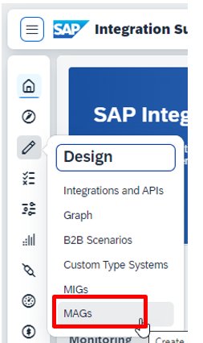
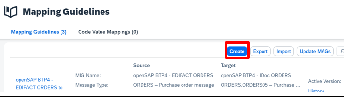
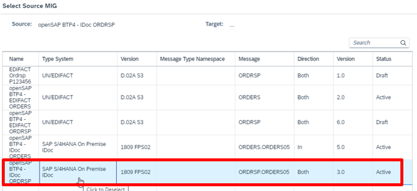
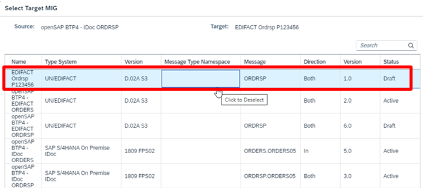
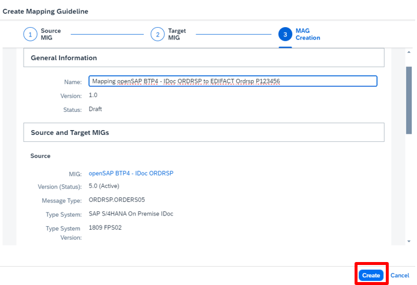
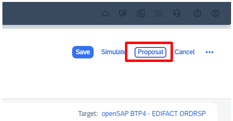
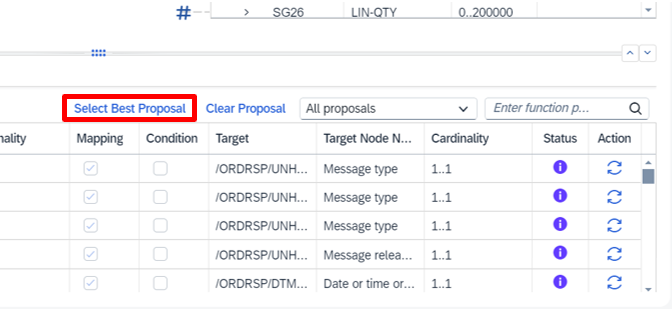
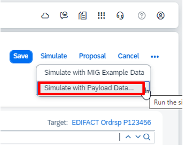

# **Exercise 1B: create new MAG**

In this exercise you have to create your own mapping to map from the IDoc Order Response Message to the EDIFACT OrdRsp Message. For each mapping you need a source and a target MIG. The source MIG has already been created by us and the target MIG had been created by yourself in the last exercise.

1. Navigate to Design and select B2B Scenarios and select MAGs.

2. As you want to create a new MAG, please press Create

3. At first you have to select the source MIG. Use the prepared one: **openSAP BTP4 – IDoc ORDRSP**. Then click Next.

4. Select as Target MIG the MIG you’ve created in the last exercise **EDIFACT Ordrsp P123456** (with P123456 your user id) and press Create.

5. Finally let the Integration Advisor Create the MAG

6. Now you want to get the proposals from the knowledge base with the Button Proposal.

7. Select the best proposal.

8. Next simulate the MAG with the IDoc you can download [here](../Payload/ordrsp-idoc.xml).

9. If you now get an additional column with the simulation results analyze the output and continue with the next exercise. You have created your first MAG.

[Continue to Exercise 1C](../Exercise1C/README.md)