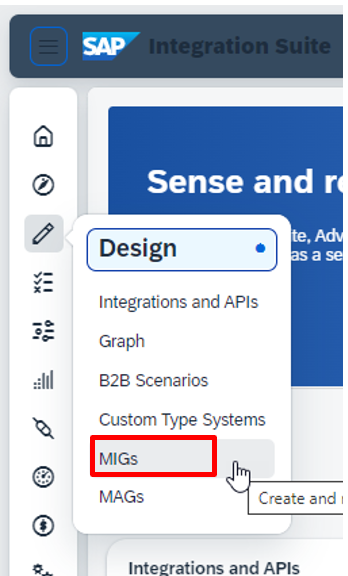
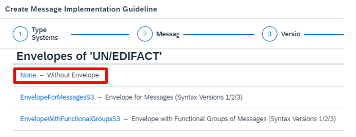
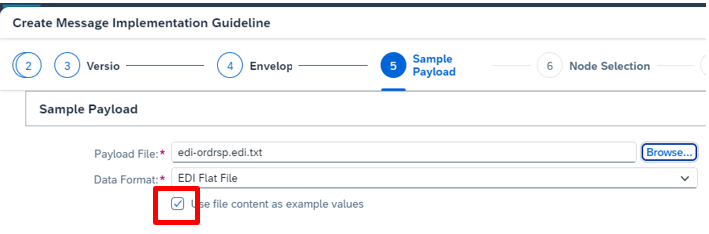
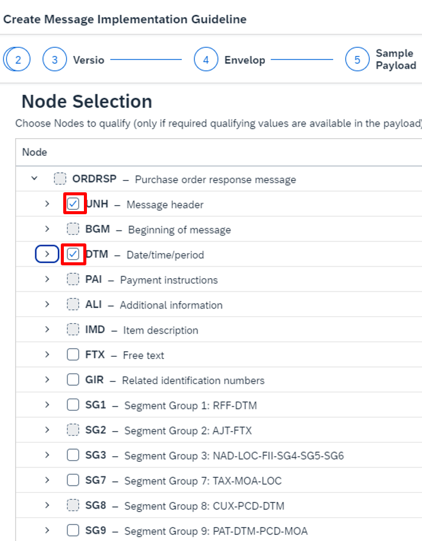
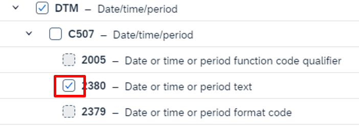
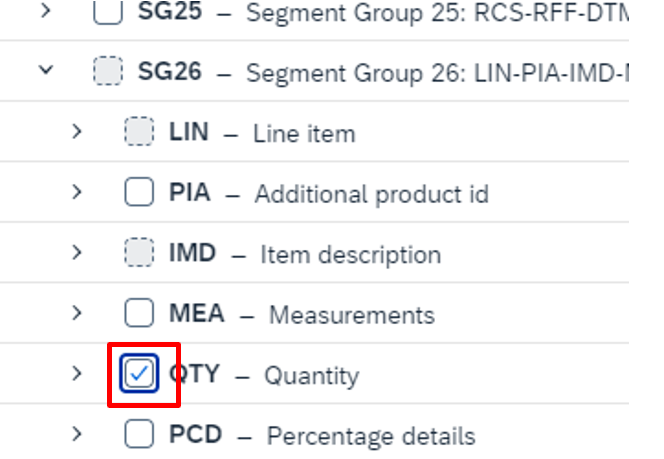
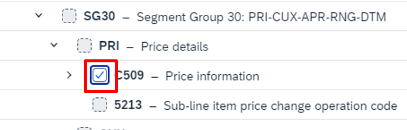
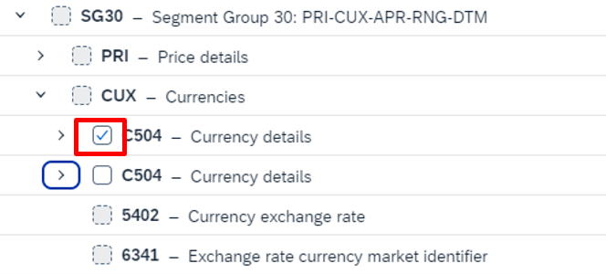
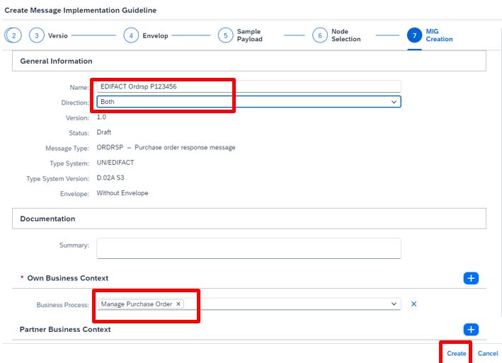
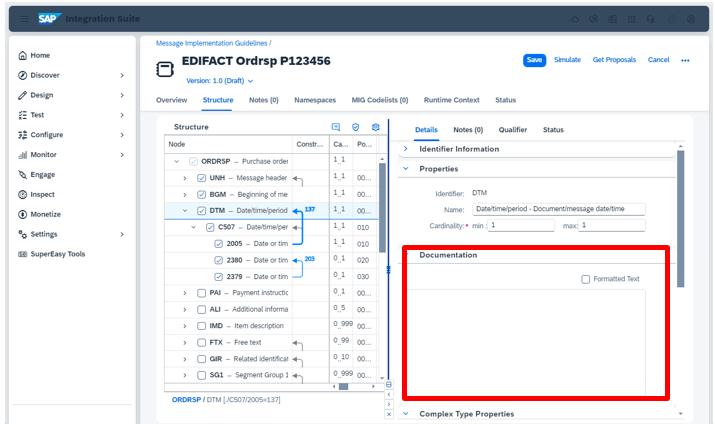

# **Exercise 1A: Create new MIG**

In the next step you will create your own MIG. \
Your Trading Partner expects the following Order Response EDIFACT Message:

<pre>
UNB+UNOC:3+1234567890123:1+UNEDI_TP_E_P123456:1+231217:1500+000255++++1'
UNH+5220230+<mark>ORDRSP</mark>mark>:D:02A:UN:DF0320'
BGM++0000347163'
DTM+<mark>97</mark>:20231004:<mark>102</mark>'
LIN+1+5'
QTY+<mark>21</mark>:8.000:PCE'
PRI+<mark>INV</mark>:5250.00'
CUX+<mark>7</mark>:USD'
LIN+2+5'
QTY+<mark>21</mark>:8.000:PCE'
PRI+<mark>INV</mark>:4400.00'
CUX+<mark>7</mark>:USD'
LIN+3+5'
QTY+<mark>21</mark>:8.000:PCE'
PRI+<mark>INV</mark>:4884.00'
CUX+<mark>7</mark>:USD'
LIN+4+5'
QTY+<mark>21</mark>:8.000:PCE'
PRI+<mark>INV</mark>:5300.00'
CUX+<mark>7</mark>:USD'
UNS+S'
UNT+19+5220230'
UNZ+1+000255'
</pre>
Download the [Payload](../../Payload/edi-ordrsp.edi)

Use that to create a MIG. The steps are finding the correct nodes in the MIG (like BGM, like DTM, like PRI, …). Then use qualifiers (I’ve marked in the payload the qualifiers in yellow).

Nodes (like QTY) which appear several times with the same qualifier will only be one time in the MIG (they have the cardinality 0..n). Don’t be scared- in the next presentation (after this exercise) you will learn more about the qualifiers and their andvantages.

Luckily there is now a brand new feature in the Integration Advisor to really help you in creating the qualifiers. This assistant is using the payload to find out which qualifiers are needed. You only need to select the correct ones. If you want to read more about this feature have a look here:Blog for payload based MIG creation

The nodes marked in grey will not be modeled in the MIG in this exercise.

**1**: Navigate to Design and select MIGs.

**2**: Click on Add to create a new MIG. Use UN/EDIFACT as Type System and ORDRSP as Message with Version D.02A S3.

**3**: As we will not need additional envelope support here (envelopes will then be handled by TPM) please choose D

**4**: Use the [Payload](../../Payload/edi-ordrsp.edi) and set the check mark!

**5**: Select now the following Nodes:
•	UNH
•	DTM

**6**: Open now the DTM node and the C507 node. Mark the 2380 node

**7**: Open the SG26 and mark “QTY”

**8**: Inside the Subgroup 26 you find the Subgroup 30. Please navigate there to CUX and then to C504 and select this.

**9**: The next is also in the SG30. Open the CUX and select the C504.

**10**: The last one is in Subgroup 36 (which is also inside SG26). Mark there the Node “TAX”

**11**: Change the Name to EDIFACT Ordrsp P123456 (with P123456 your userid). Use Direction Both and add in the Business Context the Business Process Manage Purchase Order. Then press the Button Create.

**12**: Give the Nodes and leaves meaningful names. Add documentation where it is helpful and necessary by selecting the line and use the documentation area on the right.

**13**: Save your MIG!

If you’re finished your MIG do not forget to Save it as we will use it in the next exercises!

[Continue to Exercise 1B](../3/README.md)
