# **Exercise 1B: create new MAG**

In this exercise you have to create your own mapping to map from the IDoc Order Response Message to the EDIFACT OrdRsp Message. For each mapping you need a source and a target MIG. The source MIG has already been created by us and the target MIG had been created by yourself in the last exercise.

**1**: Navigate to Design and select B2B Scenarios and select MAGs.

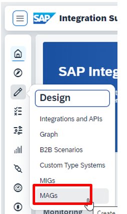

**2**: As you want to create a new MAG, please press Create

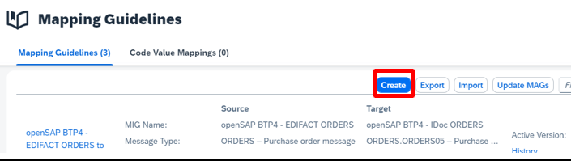

**3**: At first you have to select the source MIG. Use the prepared one: openSAP BTP4 – IDoc ORDRSP. Then click Next.

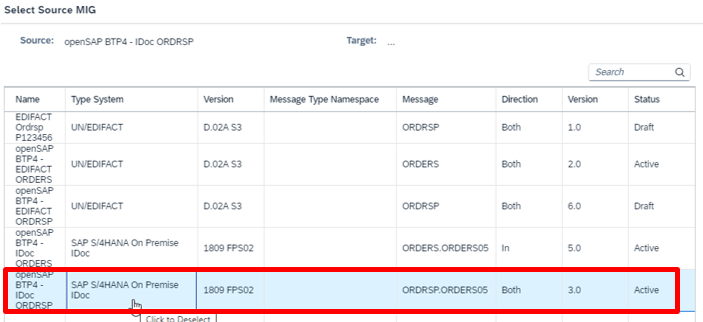

**4**: Select as Target MIG the MIG you’ve created in the last exercise EDIFACT Ordrsp P123456 (with P123456 your user id) and press Create.

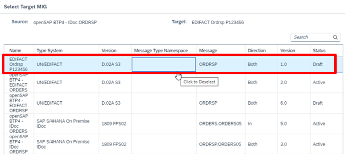

**5**: Finally let the Integration Advisor Create the MAG

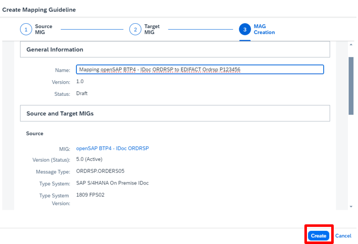

**6**: Now you want to get the proposals from the knowledge base with the Button Proposal.

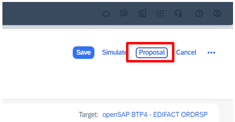

**7**: Select the best proposal.

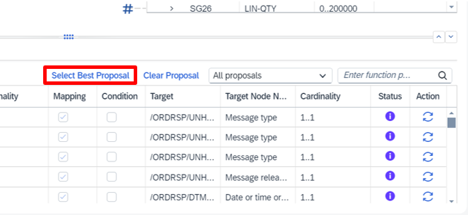

**8**: Next simulate the MAG with the IDoc you can download from discovery site “ordrsp-idoc.txt” and save as ““ordrsp-idoc.xml” using the Simulate with Payload Data.

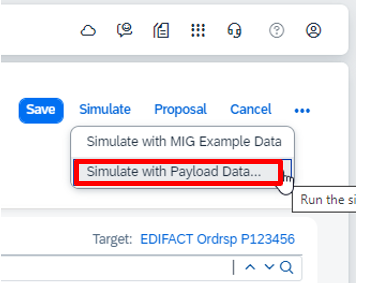

**9**: If you now get an additional column with the simulation results analyze the output and continue with the next exercise. Otherwise continue with the following steps.

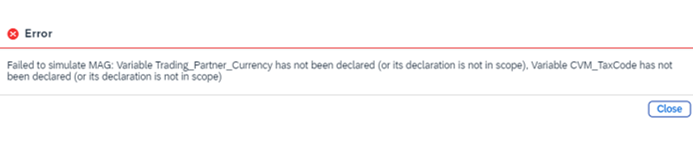

**10**: It might be that you now run into an error message like this. If this error does not appear you will directly see the simulation results. Errors like this are coming mostly from mappings with xslt functions as these are also coming from the knowledge base. If this happens you have to search for the relevant mapping in the Mapping List with the filter function and switch only that off.

**11**: As the knowledge base also might propose xslt snippets for special purposes which want to access some global parameters (which are not existing in your mapping) this is the consequence. Therefore, delete this snippet. At first you have to find it like in the screenshot. Search for CVM. Select then the found line.

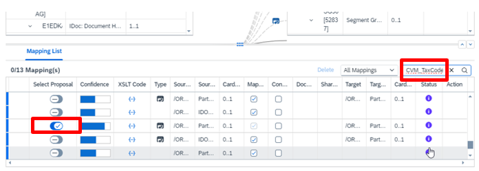

**12**: This will show you the used function. As we want to keep the mapping but not that function, please replace it with: <xsl:sequence select="$nodes_in/*"/>

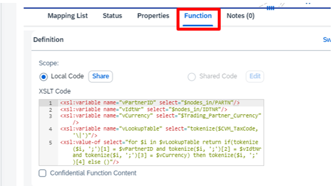

**13**: Try again the simulation. Very likely you will get now an additional column in source and target. Check all elements and compare with the edifact example at the beginning of the MIG exercise. Adjust the mapping till all elements are correct.

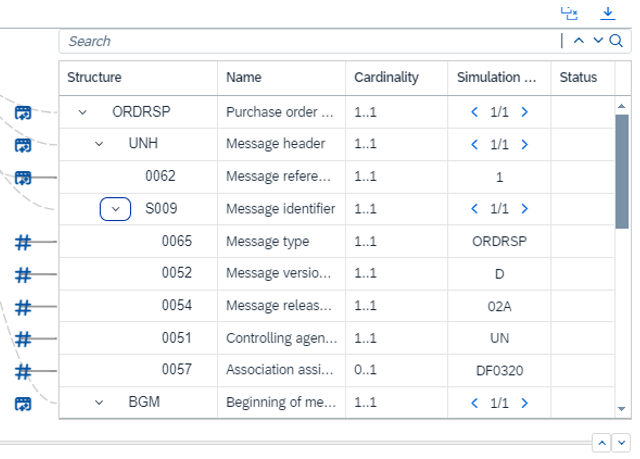

**14**: On some elements you have to use constants (e.g., 0065, 0052, 0054, 0057) as not all necessary values are existing in the source.

[Continue to Exercise 1C](../4/README.md)
