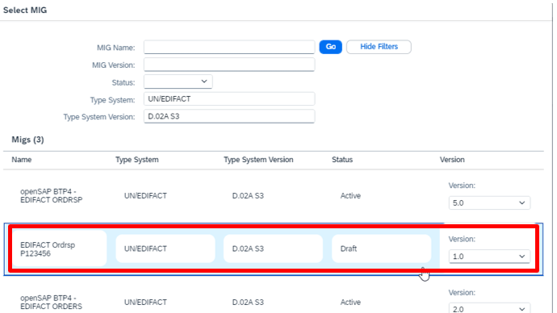

# **Exercise 1C: use new MIG and MAG**

After you’ve created now a MIG for the EDIFACT Order Response Message and a MAG to map from the IDoc Order Response to the Edifact message you need to change your trading partner agreement to use the newly created MIG and MAG.

**1**: Navigate to the B2B Scenarios

**2**: Go to Tab Agreements and open the Trading Partner Agreement you’ve created in exercise 1 (the name should be Procure to Pay – P123456 with P123456 your user id)

**3**: Switch from the Overview to the B2B Scenarios

**4**: And there to the edit mode.

**5**: Select the Interchange in the second line (where the definition of the order response message is)

**6**: Use the dropdown to change the MIG. In case no MIG is listed click on Reset and select your MIG (EDIFACT Ordrsp P123456 with P123456 your user id) and click Choose.

**7**: Now select the Mapping for the outgoing message.

**8**: Use the dropdown to change the MAG. In case no MAG is listed click on Reset and select your MAG and click on Choose.

You may use the Search box on the right side and search for your user id. 
(Your MAG Name will be Mapping openSAP BTP4 – Idoc ORDRSP to EDIFACT Ordrsp P123456 with P123456 your user id) 

**9**: Save the Trading Partner Agreement

**10**: Update your scenario

Now you can again send a test message with the iflow you’ve copied in exercise 1 and look at the monitoring and in your personal inbox if everything works fine.

